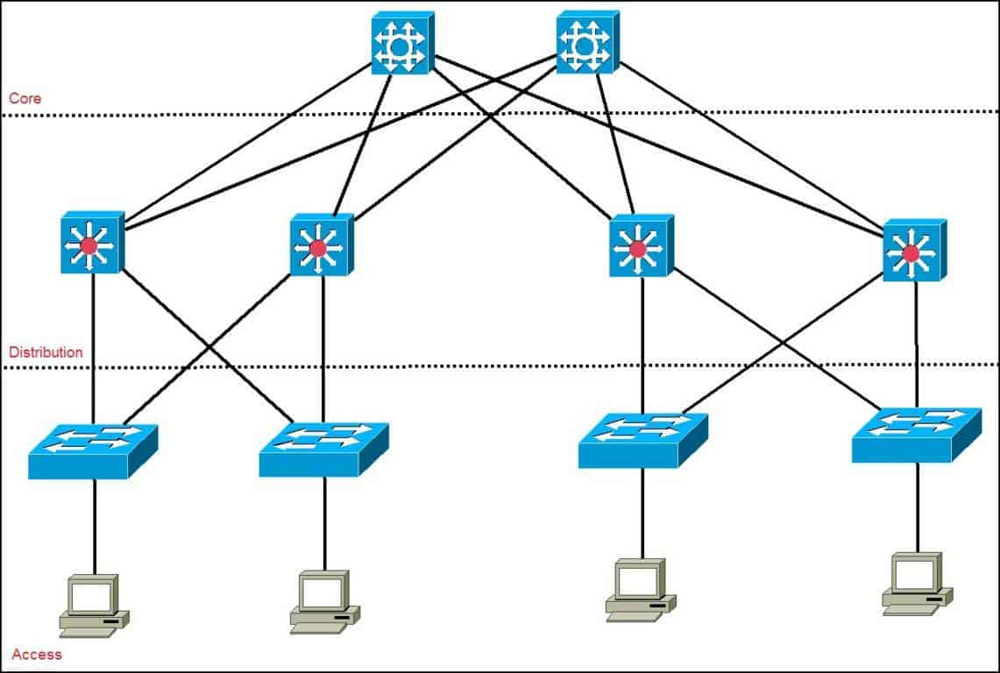
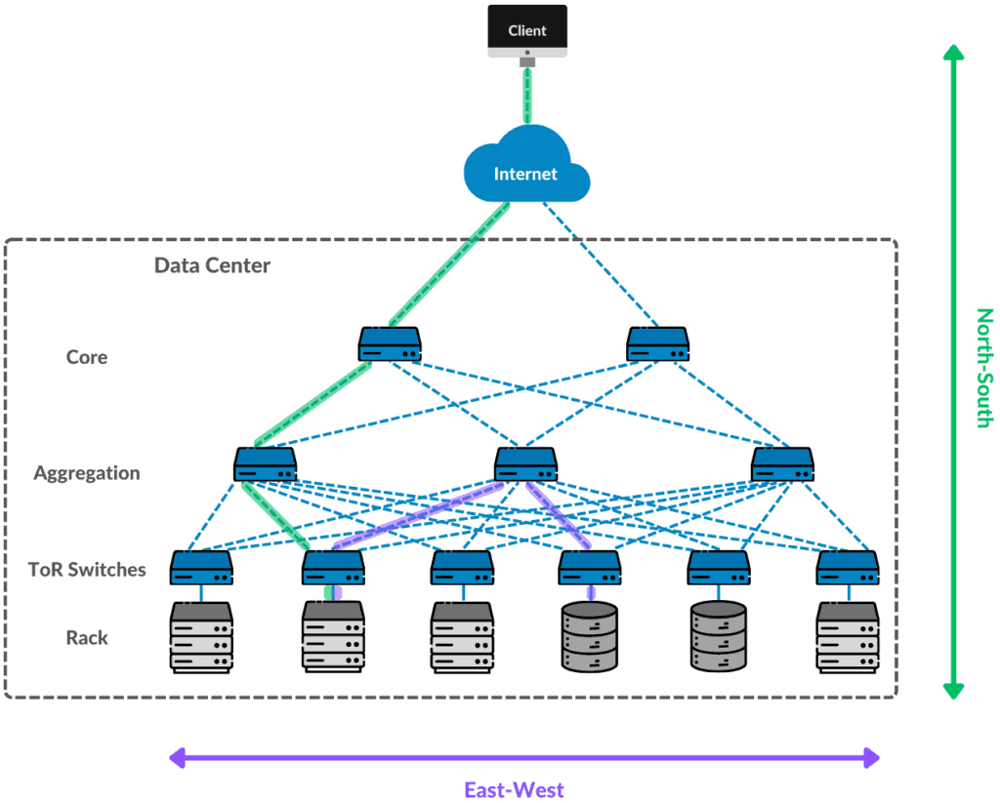

## What is a Network?

- A **network** is a web of computers and devices that share resources and information.
- Networks can be categorized by their size and structure.
- The main purpose of a network is to **share resources**.

- **Host**: A device with an IP address.
- **Server**: A device that serves information, such as a print server, file server, database server, etc.

## Types of Networks

**LAN** - Local Area Network
- Covers a small geographic area, such as a home, office, or building.
- Used for sharing resources such as files and printers.
- Can have anywhere from 2 to 1,000 machines.
  
**WLAN** - Wireless LAN
- A wireless version of a LAN.
  
**WAN** - Wide Area Network
- Can cover a large geographic area, such as countries or continents.
- The **internet** is the largest WAN.

**SD-WAN** - Software Defined Wide Area Network
- Uses software to manage and optimize wide area network (WAN) traffic

**MAN** - Metropolitan Area Network
- Covers a larger area than a LAN but smaller than a WAN.
- Used by businesses with multiple buildings that are connected.

**CAN** - Campus Area Network
- Interconnects multiple LANs within a limited geographic area.
- Examples include university campuses, corporate campuses, and industrial complexes.

[**SAN - Storage Area Network](3.%20Network%20Devices.md#Storage%20Area%20Network%20(SAN))
- Provides access to consolidated data storage.
- Primarily used to enhance storage devices, such as disk arrays, tape libraries, and optical jukeboxes, making them appear as locally attached devices to servers.

**PAN** - Personal Area Network
- Covers a very small area, such as a single room.
- Example: Bluetooth connections between a phone and headset.

## Peer-to-peer vs. Client-to-server

**P2P** - Peer-to-Peer
- Decentralized network architecture where each device (peer) can act as both a client and a server.
- Allows direct sharing of resources, data, and services among all connected devices without a centralized server.
- Ideal for smaller networks.

**C2S** - Client-to-Server
- A network architecture where multiple client devices (computers, smartphones, etc.) connect to a central server to access shared resources, services, and applications.
- The client initiates a request, and the server responds to the request.

## Backbone vs Segments

### Backbone
- Is a central, high capacity transmission path that connects different parts of a network
- Its the primary communication channel that interlinks various segments, networks, or devices
- Is typically composed of high-speed, high-capacity links and core routers
- **High Capacity** - They are designed to carry large amounts of data with a high bandwidth
- **Core of the Network** - It connects different network segments, devices, and somethings entire networks, WANs, data centers, etc.
- **Centralized Role** - The backbone ensures that data can travel across different parts of the network, facilitating communication between geographically dispersed locations.
- **Scalability** - Often designed to be scalable and expandable to accommodate growing network traffic.
- Example - In an enterprise network, the backbone could be a fiber optic link connecting multiple buildings or departments, ensuring all devices within the network can communicate.

### Segment
- A smaller, more localized portion of a network that typically connects a group of devices (computers, printers, etc.) within a particular area.
- Smaller subnetworks or clusters of device connected to the backbone.
- They rely on the back bone to communicate with other segments.
- **Smaller and Localized** - A segment refers to a subset of the network, such as all devices connected to a specific switch or hub.
- **Traffic Management** - Within a segment, all devices share a common communication medium. In the past, this could have been a shared Ethernet segment, but modern networks often use switches to segment traffic.
- **Subnetting** - A network segment can also be a subnet, which is a logical subdivision of an IP network. A segment in this case refers to devices within the same subnet that can communicate directly without needing a router.
- **Lower Capacity** - Compared to the backbone, segments typically have lower data transmission capacity as they are designed for smaller groups of devices.
- **Example** - A LAN or VLAN in a single office building, where all devices are connected via switches

## Topologies

**Network Topology**
- describes the layout/arrangement of the elements in a computer network
- Each arrange influences networks performance, reliability, and scalability

**Point-to-Point**
- Involves a direct connection between two networking devices, typically with a cable or wireless link
- Is mainly used for dedicated connections, such as those between a main office and a branch office, or two pieces of network equipment.

**Mesh**
- No central connecting point, Every host is connected to every other host
- Ensure high availability and redundancy, if one link fails, data can always be rerouted
- Advantages
	- Most fault-tolerant
- Disadvantages
	- Most expensive
	- Most complex
	- Most difficult to expand

**Star/Hub-and-Spoke**
- All nodes are connected to a central node such as a switch, hub, or wireless access point
- This setup simplifies network management and troubleshooting but creates a single point of failure.
- Failure of the central node could bring down the entire network

**Bus**
- Is the most basic of the bunch
- Consists of two distinct and terminated ends, with each computer connected to on unbroken cable running its entire length
- Advantages
	- Easy to install and is very cheap
- Disadvantages
	- Difficult to troubleshoot
	- hard to change or move
	- Any fault in the cable will bring the entire network down.

**Ring**
- Computers are directly connected to each other, network data flows from computer to computer until it gets back to the source
- Issue is if you want to add a computer, you have to break the ring and take out the entire network

**Hybrid**
- Combines multiple topologies leveraging the advantages of them all
- It offers flexibility in network design and can be tailored to meet specific need or constraints.

## Three-Tiered Hierarchal Model

There are three main layers in Cisco's 3-tiered model: core, distribution, access.

**Core**
- Where all the routing happens, backbone
- Handles all high speed switching across the entire network
- Should have high redundancy and fault tolerance to prevent downtime
- Nothing should be done in the core layer so it remains fast

**Distribution**
- Helps with routing, filtering, security policies, and WAN access
- It aggregates the data received from the access layer switches before its transmitted to the core layer for routing to the final destination

**Access Layer**
- Referred to as the edge switching later, and it connects the end-user hosts
- Can be access points or regular devices
- Provides local switching and the creation of collisions domains

## Spine and Leaf Network Design

Spine and Leaf architecture is a two-layer network topology that is highly scalable and minimizes latency by ensuring that every leaf switch (access layer) is separated by no more than two switches from any other leaf.

Spine switches only connect to leaf switches and vice versa.
This provides extremely high data access speeds since you would only need to go through two layers to access the data you need.

**Leaf Switch**
- This is the access layer of the network.
-  Leaf switches connect to the servers, storage devices, and other endpoints in the data center.
- Leaf switches are responsible for forwarding traffic between the endpoints.
- Each leaf switch is typically connected to every spine switch, allowing for equal-cost paths to all devices.

**Spine Switch**
- Spine switches form the core layer of the network. These switches handle the intercommunication between leaf switches.
- Spine switches do not connect directly to endpoints (like servers). Instead, they provide high-throughput, low-latency connections between leaf switches.
- The spine layer ensures that all traffic, no matter where it originates or terminates, passes through one or more spine switches.

## Collapsed Core Network Design

This design merges the core and distribution layers into a single layer, simplifying the network design and reducing hardware costs.

This is ideal for small to medium networks, where managing separate layers is unnecessary.
This architecture facilitates easier management and maintenance while enhancing performance by reducing latency between the network's core and distribution functions.

## North South vs East West Traffic

**North - South**
- Refers to the flow of data that moves in and out of a data center or network.
- Typically involves client-to-server communications, where clients access services hosted in the data center

**East - West**
- Refers to the flow of data within data centers or networks
- This includes server-to-server, server-to-storage, and VM-to-VM traffic

## Traffic Flow

**Unicast**
- Is a one-to-one form of communication where data is sent from one source to one specific destination identified by a unique IP address.
- It is the most common form of IP communication, used for most internet traffic, web browsing, email, file transfers, etc.
- Unicast ensures that data packets are delivered to a single specific recipient over a network

**Multicast**
- Data is sent from one or more sources to multiple destinations simultaneously over a network, using a specific multicast group address.
- Is efficient for applications like streaming video or audio, where the same data need to be delivered to multiple recipients.
- This reduces bandwidth consumption compared to sending separate copies of the data to each recipient.
- This approach is used in both IPv4 and IPv6 networks to optimize the delivery of packets to multiple destinations.

**Anycast**
- Data is sent to the nearest or best destination as determined by routing protocols, from among multiple potential destinations sharing the same address.
- It is used in IPv6 (less so with IPv4) to provide fast efficient deliver of services by directing users to the closes server.
- Commonly used in DNS and CDN (content delivery network) service
- Anycast can improve network performance and availability by automatically routing requests to the nearest data center.

**Broadcast**
- A message is sent from one sender to *all* potential receivers within a network segment
- In IPv4, the broadcast address is used to send data to all devices on a LAN simultaneously, such as when a device requests and IP address via DHCP
- Broadcast is *not supported* in IPv6, instead multicast address are used for similar purposes